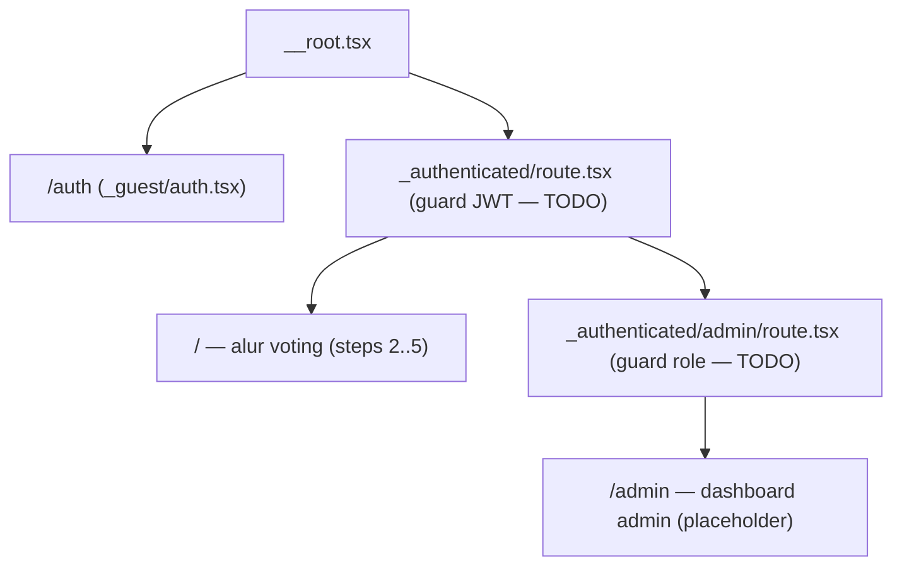
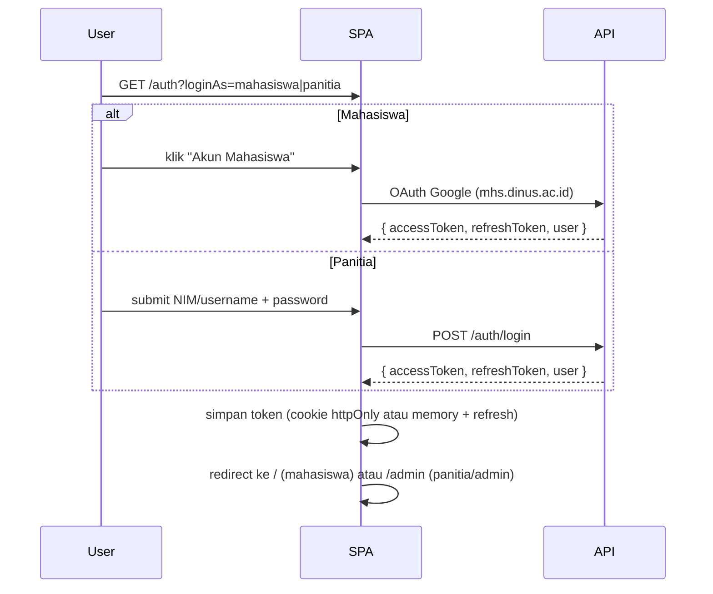
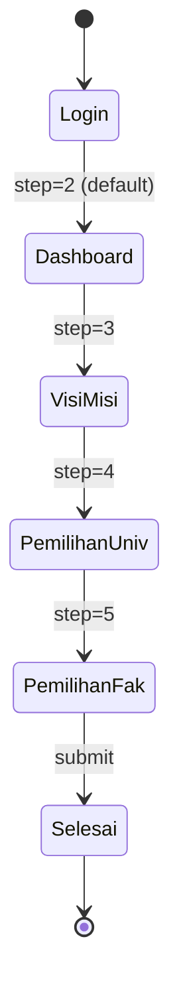

# Design Document — PEMIRA 2026 SPA

Dokumen ini merangkum arsitektur **as-is** dari aplikasi `pemira-spa` sekaligus
**roadmap** untuk area yang belum diimplementasi. Acuan utama: file `package.json`,
`vite.config.ts`, `tsconfig.json`, dan struktur `src/`.

---

## 1. Pendahuluan

**PEMIRA 2026** adalah Single Page Application (SPA) untuk Pemilihan Raya
Universitas Dian Nuswantoro. Aplikasi ini menjadi portal pemungutan suara
elektronik dengan tiga peran utama:

- **Mahasiswa** — pemilih, login via akun universitas (`mhs.dinus.ac.id`).
- **Panitia** — operasional pemilu, login via username/password.
- **Admin / Superadmin** — pengelolaan periode, kandidat, dan rekap suara.

Tujuan dokumen:

1. Memberi peta arsitektur untuk kontributor baru.
2. Mendokumentasikan konvensi yang sudah berjalan.
3. Menandai area `TODO` yang masih harus dikerjakan.

---

## 2. Tech Stack

| Kategori          | Pilihan                                                        |
| ----------------- | -------------------------------------------------------------- |
| Runtime / PM      | Bun (lihat `bun.lock`)                                         |
| Framework UI      | React 19, ReactDOM 19                                          |
| Routing           | TanStack Router (file-based, auto code splitting)              |
| Data fetching     | TanStack Query + Devtools                                      |
| Bundler           | Vite 8 + `@vitejs/plugin-react`                                |
| Styling           | Tailwind CSS v4 (`@tailwindcss/vite`), `tw-animate-css`        |
| Komponen          | shadcn/ui (style `new-york`, base `zinc`), Radix UI primitives |
| Ikon              | `lucide-react`                                                 |
| Validasi          | Zod 4                                                          |
| Env config        | `@t3-oss/env-core`                                             |
| Linter / Formatter | Biome 2.4 (`bun run check`)                                   |
| Bahasa            | TypeScript strict                                              |

---

## 3. Struktur Direktori

```
pemira-spa/
├── index.html
├── vite.config.ts
├── tsconfig.json
├── biome.json
├── components.json              # shadcn config
├── public/
└── src/
    ├── main.tsx                 # entry — bootstrap router + QueryClient
    ├── router.tsx               # createTanStackRouter + tipe Register
    ├── routeTree.gen.ts         # auto-generated, JANGAN diedit manual
    ├── env.ts                   # validasi env via Zod
    ├── styles.css               # Tailwind v4 + design tokens (oklch)
    ├── routes/
    │   ├── __root.tsx
    │   ├── _guest/
    │   │   └── auth.tsx
    │   └── _authenticated/
    │       ├── route.tsx        # guard mahasiswa (TODO JWT)
    │       ├── index.tsx        # alur voting steps 2..5
    │       └── admin/
    │           ├── route.tsx    # guard admin (TODO role)
    │           └── index.tsx
    ├── features/
    │   ├── auth/
    │   │   ├── components/{auth-hero,footer-stat,google-login-button,login-form}.tsx
    │   │   └── index.ts         # barrel
    │   └── authenticated/
    │       ├── components/{breadcrumbs-path,greeting-pill,dashboard,visi-misi,
    │       │              calon-card,badge-visimisi,pemilihan-universitas,
    │       │              pemilihan-fakultas,footer-user}.tsx
    │       ├── utils/breadrumbs-items.tsx
    │       └── index.ts
    ├── components/ui/           # shadcn + komponen custom
    │   ├── button.tsx, card.tsx, field.tsx, input.tsx, input-group.tsx,
    │   │   item.tsx, label.tsx, progress.tsx, separator.tsx, textarea.tsx,
    │   │   breadcrumb.tsx, badge.tsx
    │   ├── navbar.tsx           # custom — top bar
    │   ├── stepper.tsx          # custom — indikator langkah
    │   └── statistik-pemilihan.tsx
    ├── integrations/tanstack-query/
    │   ├── root-provider.tsx    # getContext() → { queryClient }
    │   └── devtools.tsx
    └── lib/utils.ts             # cn(...inputs) helper
```

Aturan barrel: tiap fitur mengekspos public API lewat `index.ts`
(mis. `src/features/auth/index.ts:1`).

---

## 4. Konvensi & Tooling

### Path alias
`tsconfig.json:8` dan `vite.config.ts:36` mendefinisikan dua alias yang sama:

```ts
"#/*": ["./src/*"],
"@/*": ["./src/*"]
```

`package.json:5` juga mendaftarkan `imports."#/*": "./src/*"`. Saat ini codebase
masih bercampur memakai `#/` dan `@/` untuk file yang sama. **Rekomendasi**:
pilih satu (mis. `#/` untuk runtime, `@/` untuk shadcn-generated) dan jalankan
codemod ringan.

### Biome (`biome.json`)

- `formatter.indentStyle: "tab"` + `quoteStyle: "double"`.
- `assist.organizeImports: "on"`.
- Cakupan: `src/**`, `index.html`, `vite.config.ts`. `routeTree.gen.ts`
  otomatis terabaikan karena di-mark `@ts-nocheck` & komentar.

### Tailwind v4

- Konfigurasi dilakukan **di CSS** (`styles.css:1`) dengan `@import "tailwindcss"`,
  bukan `tailwind.config.js`.
- Token warna memakai `oklch` (`styles.css:11`) + dark variant
  `@custom-variant dark (&:is(.dark *))` (`styles.css:8`).
- Plugin: `@tailwindcss/typography`, `tw-animate-css`, `tailwindcss-animated`.
- Font: Plus Jakarta Sans di-import dari Google Fonts.

### shadcn/ui (`components.json`)

- Style `new-york`, base color `zinc`, ikon `lucide`.
- Aliases: `components → #/components`, `ui → #/components/ui`,
  `utils → #/lib/utils`, `hooks → #/hooks` (folder belum ada).
- Registry tambahan `@react-bits` aktif.

### Scripts (`package.json`)

```bash
bun run dev       # vite dev server
bun run build     # tsc && vite build
bun run preview   # vite preview
bun run lint      # biome lint .
bun run format    # biome format . --write
bun run check     # biome check . --write   (lint + format + organize)
```

---

## 5. Routing & Navigasi

### Pohon Route



### Router config (`src/router.tsx:5`)

```ts
createTanStackRouter({
  routeTree,
  context,                         // { queryClient }
  scrollRestoration: true,
  defaultPreload: "intent",
  defaultPreloadStaleTime: 0,
});
```

`autoCodeSplitting` diaktifkan di plugin Vite (`vite.config.ts:30`), sehingga
setiap route otomatis dipisah menjadi chunk tersendiri.

### Search Params

| Route                  | Schema (Zod)                                                                                                  | File                                  |
| ---------------------- | ------------------------------------------------------------------------------------------------------------- | ------------------------------------- |
| `/auth`                | `loginAs ∈ {mahasiswa, panitia}` (default `mahasiswa`)                                                        | `src/routes/_guest/auth.tsx:11`       |
| `/` (`_authenticated`) | `steps ∈ [2..5]` (default `2`), `visiMisi ∈ {PRESIDENT, DPM, FACULTY_GOVERNOR}` (default `DPM`)               | `src/routes/_authenticated/index.tsx:12` |

`Route.useSearch()` dipakai oleh komponen turunan untuk membaca state alur,
mis. `BreadcrumbsPath` (`src/features/authenticated/components/breadcrumbs-path.tsx:14`).

### Auth Guard (TODO)

- `src/routes/_authenticated/route.tsx:14` — `beforeLoad` masih `console.log`.
  Harus memvalidasi JWT, mengisi context user, dan `throw redirect({ to: "/auth" })`
  bila invalid.
- `src/routes/_authenticated/admin/route.tsx:8` — sama, plus pemeriksaan role
  `ADMIN | SUPERADMIN`.

---

## 6. State & Data Layer

### Posisi saat ini

- `getContext()` (`src/integrations/tanstack-query/root-provider.tsx:3`) membuat
  satu instance `QueryClient` dan mengembalikannya sebagai router context.
- `main.tsx:16` membungkus aplikasi dengan `QueryClientProvider` memakai client
  yang sama lewat `router.options.context.queryClient`.
- Belum ada hook query/mutation atau service layer; data komponen masih
  hardcoded (lihat `dashboard.tsx`, `calon-card.tsx`, `statistik-pemilihan.tsx`).

### Pola yang diusulkan

```
src/
├── services/
│   └── election/
│       ├── api.ts         # fetcher (fetch wrapper + base URL dari env)
│       ├── schema.ts      # Zod schemas
│       └── keys.ts        # query key factory
├── hooks/
│   ├── queries/
│   │   ├── useActivePeriod.ts
│   │   ├── useCandidates.ts
│   │   └── useVoteStats.ts
│   └── mutations/
│       └── useSubmitVote.ts
```

Loader route bisa memanggil `queryClient.ensureQueryData(opts)` agar bekerja
sama dengan `defaultPreload: "intent"`.

> Catatan: `TanstackQueryProvider()` di `root-provider.tsx:10` adalah fungsi
> kosong sisa scaffold. Hapus atau implementasikan sebelum produksi.

---

## 7. Auth & Otorisasi

### Alur login



### Storage token

- **Disarankan**: cookie `httpOnly` + `SameSite=Lax` bila backend di domain
  yang sama → kebal XSS.
- **Fallback**: in-memory + refresh token di cookie. Hindari menyimpan access
  token di `localStorage`.

### Pemetaan peran

| Peran        | Login source                | Akses                             |
| ------------ | --------------------------- | --------------------------------- |
| `MAHASISWA`  | Google `mhs.dinus.ac.id`    | `/` (alur voting)                 |
| `PANITIA`    | username/password           | `/admin` (subset operasional)     |
| `ADMIN`      | username/password           | `/admin` (manajemen)              |
| `SUPERADMIN` | username/password           | `/admin` (manajemen + konfigurasi)|

### Implementasi `beforeLoad`

```ts
// _authenticated/route.tsx (target)
beforeLoad: async ({ context, location }) => {
  const session = await context.queryClient.ensureQueryData(sessionQuery);
  if (!session) {
    throw redirect({ to: "/auth", search: { redirect: location.href } });
  }
  return { session };
},
```

```ts
// _authenticated/admin/route.tsx (target)
beforeLoad: ({ context }) => {
  const role = context.session?.role;
  if (role !== "ADMIN" && role !== "SUPERADMIN" && role !== "PANITIA") {
    throw redirect({ to: "/" });
  }
},
```

---

## 8. Domain Model & Alur Voting

### State machine alur mahasiswa



`pageChanger` map (`src/routes/_authenticated/index.tsx:25`):

| Step | Komponen                | Status                |
| ---- | ----------------------- | --------------------- |
| 2    | `Dashboard`             | implemented           |
| 3    | `VisiMisi`              | UI ada, fetch TODO    |
| 4    | `PemilihanUniversitas`  | placeholder kosong    |
| 5    | `PemilihanFakultas`     | placeholder kosong    |

Navigasi antar-step lewat search param `steps` di `FooterUser`
(`src/features/authenticated/components/footer-user.tsx:11`). Saat ini ada
`@ts-expect-error` di baris 40 karena tujuan `to="/selesai"` belum dibuat.

### Kategori `visiMisi`

Didefinisikan inline di `BadgeVisiMisi` (`src/features/authenticated/components/badge-visimisi.tsx:4`):

```ts
const VISI_MISI_ITEMS = [
  { label: "DPM KM",                value: "DPM" },
  { label: "Presiden BEM KM",       value: "PRESIDENT" },
  { label: "Gubernur BEM Fakultas", value: "FACULTY_GOVERNOR" },
] as const;
```

**Rekomendasi**: pindahkan ke `src/services/election/schema.ts` agar bisa
di-share dengan loader & form.

### Aturan bisnis

Diambil dari copy `Dashboard` (`src/features/authenticated/components/dashboard.tsx:9`):

- 1 mahasiswa = 1 suara sah per kategori.
- Pilihan bersifat rahasia.
- Suara tidak dapat diubah setelah dikirim (irreversible).
- Suara dienkripsi sebelum disimpan ke kotak suara digital.

---

## 9. Kontrak API (Usulan)

Base URL berasal dari `import.meta.env.VITE_API_URL` (`src/env.ts:17`, divalidasi
sebagai URL).

### Skema Zod usulan

```ts
// src/services/election/schema.ts
import { z } from "zod";

export const RoleEnum = z.enum(["MAHASISWA", "PANITIA", "ADMIN", "SUPERADMIN"]);

export const CategoryEnum = z.enum(["DPM", "PRESIDENT", "FACULTY_GOVERNOR"]);

export const UserSchema = z.object({
  id: z.string(),
  name: z.string(),
  email: z.email(),
  nim: z.string().optional(),
  facultyId: z.string().nullable(),
  role: RoleEnum,
});

export const ActivePeriodSchema = z.object({
  id: z.string(),
  name: z.string(),
  startsAt: z.iso.datetime(),
  endsAt: z.iso.datetime(),
  isActive: z.boolean(),
});

export const CandidateSchema = z.object({
  id: z.string(),
  number: z.number().int().positive(),
  name: z.string(),
  major: z.string(),
  year: z.string(),
  type: CategoryEnum,
  vision: z.string(),
  programs: z.array(z.string()),
  facultyId: z.string().nullable(),
});

export const VoteStatsSchema = z.object({
  registered: z.number().int().nonnegative(),
  voted: z.number().int().nonnegative(),
  candidatesCount: z.number().int().nonnegative(),
});

export const SubmitVoteRequestSchema = z.object({
  candidateId: z.string(),
  type: CategoryEnum,
});

export const SubmitVoteResponseSchema = z.object({
  ok: z.literal(true),
  receiptId: z.string(),
});

export type Candidate = z.infer<typeof CandidateSchema>;
export type ActivePeriod = z.infer<typeof ActivePeriodSchema>;
export type User = z.infer<typeof UserSchema>;
```

### Endpoint utama

| Method | Path                                              | Auth         | Tujuan                                       |
| ------ | ------------------------------------------------- | ------------ | -------------------------------------------- |
| POST   | `/auth/login`                                     | guest        | Login panitia/admin (username + password)    |
| POST   | `/auth/google`                                    | guest        | Login mahasiswa (id_token Google)            |
| POST   | `/auth/refresh`                                   | refresh tkn  | Tukar refresh token jadi access token        |
| POST   | `/auth/logout`                                    | session      | Invalidasi sesi                              |
| GET    | `/auth/session`                                   | session      | Profil user aktif                            |
| GET    | `/election/active-period`                         | session      | Periode aktif                                |
| GET    | `/election/active-period/categories`              | session      | Kategori yang tersedia untuk user            |
| GET    | `/election/candidates?type=DPM\|PRESIDENT\|...`   | session      | Daftar paslon per kategori                   |
| GET    | `/election/stats`                                 | publik/session | Statistik (registered, voted, candidates)  |
| POST   | `/votes`                                          | mahasiswa    | Submit suara untuk satu kategori             |
| GET    | `/admin/results`                                  | admin        | Rekap suara (dashboard admin)                |

---

## 10. UI System

### Design tokens

- File tunggal: `src/styles.css`.
- Light mode di `:root` (`styles.css:10`), dark mode di `.dark`
  (`styles.css:73`).
- Token utama: `--background`, `--foreground`, `--primary`, `--accent`,
  `--destructive`, `--ring`, `--sidebar-*`, plus `--shadow-*`, `--radius`.
- `@theme inline` (`styles.css:134`) memetakan custom property ke utility class
  Tailwind v4 (mis. `bg-primary`, `text-muted-foreground`).

### Komponen

| Tipe       | File                                              | Catatan                                  |
| ---------- | ------------------------------------------------- | ---------------------------------------- |
| shadcn     | `components/ui/button.tsx` dst.                   | generated, jangan di-edit ad-hoc         |
| Custom     | `components/ui/navbar.tsx:3`                      | Top bar publik                           |
| Custom     | `components/ui/stepper.tsx:3`                     | Indikator step (1..5)                    |
| Custom     | `components/ui/statistik-pemilihan.tsx:16`        | Variant `default` & `outline`            |
| Composite  | `features/authenticated/components/calon-card.tsx:13` | Kartu paslon (data masih hardcoded)  |

### Animasi

Memakai utility `tailwindcss-animated`:

- `animate-fade animate-once animate-ease-in-out animate-fill-forwards`
  (`dashboard.tsx:36`).
- `animate-fade-right ...` (`visi-misi.tsx:17`).

### Responsif

- Mobile-first; breakpoint `md` (≥768px) dan `lg` (≥1024px).
- Layout dua kolom auth (`_guest/auth.tsx:22`): hero di order pertama mobile,
  pindah ke kanan pada `md+`.
- Layout `_authenticated/index.tsx:32` bekerja sebagai full-height column dengan
  footer navigasi.

---

## 11. Build & Performa

### Code splitting

`vite.config.ts:11` menetapkan `manualChunks`:

```ts
manualChunks: (id) => {
  if (id.includes("node_modules/react-dom") || id.includes("node_modules/react/")) return "vendor-react";
  if (id.includes("node_modules/@tanstack/react-router")) return "vendor-router";
  if (id.includes("node_modules/@tanstack/react-query"))  return "vendor-query";
}
```

Plus `tanstackRouter({ autoCodeSplitting: true })` (`vite.config.ts:29`)
menghasilkan chunk per route.

### Bundle stats

Output `bundle-stats.html` ada di root. Generate ulang setelah perubahan besar
untuk memantau ukuran chunk.

### Strict TypeScript

`tsconfig.json:14` mengaktifkan `strict`, `noUnusedLocals`, `noUnusedParameters`,
`noFallthroughCasesInSwitch`. `bun run build` selalu menjalankan `tsc` lebih
dulu sehingga error tipe akan menggagalkan build.

---

## 12. Quality Gates

| Gate         | Perintah          | Catatan                                                  |
| ------------ | ----------------- | -------------------------------------------------------- |
| Format       | `bun run format`  | Biome format                                             |
| Lint         | `bun run lint`    | Biome lint                                               |
| Format+Lint  | `bun run check`   | Sekaligus organize imports                               |
| Type + Build | `bun run build`   | `tsc` strict → `vite build`                              |

Belum ada test runner. Rekomendasi:

- **Unit/komponen**: Vitest + `@testing-library/react`.
- **Service/data**: MSW untuk mock REST.
- **E2E** (opsional): Playwright untuk skenario login + voting penuh.

---

## 13. Roadmap / TODO

Daftar berikut diambil langsung dari kode yang masih placeholder atau ada
komentar TODO:

1. **Auth guard mahasiswa** — `src/routes/_authenticated/route.tsx:14`.
2. **Role guard admin** — `src/routes/_authenticated/admin/route.tsx:8`.
3. **Fetching real visi-misi** — `src/features/authenticated/components/visi-misi.tsx:6`
   (komentar menjabarkan flow `/api/election/active-period/categories`).
4. **Halaman Pemilihan Universitas** — `src/features/authenticated/components/pemilihan-universitas.tsx:3`
   (return div kosong).
5. **Halaman Pemilihan Fakultas** — `src/features/authenticated/components/pemilihan-fakultas.tsx:3`.
6. **Footer "Selesai"** — hilangkan `@ts-expect-error` di
   `src/features/authenticated/components/footer-user.tsx:40` setelah route
   `/selesai` (atau equivalent) dibuat.
7. **TanstackQueryProvider kosong** — `src/integrations/tanstack-query/root-provider.tsx:10`,
   hapus atau definisikan.
8. **Dashboard admin** — `src/routes/_authenticated/admin/index.tsx:7` masih
   "Hello".
9. **Konsistensi alias `#/` vs `@/`** — tentukan satu konvensi dan jalankan
   refactor.
10. **`CalonCard` masih hardcoded** — `src/features/authenticated/components/calon-card.tsx:14`,
    perlu menerima props dari hasil query.

---

## 14. Lampiran

### Variabel Environment

| Variabel          | Tipe (Zod)        | Wajib | Sumber                |
| ----------------- | ----------------- | ----- | --------------------- |
| `VITE_APP_TITLE`  | `string` (opsional) | ✗   | `src/env.ts:16`       |
| `VITE_API_URL`    | `URL`             | ✓     | `src/env.ts:17`       |

`emptyStringAsUndefined: true` (`src/env.ts:39`) berarti string kosong di `.env`
diperlakukan sebagai `undefined`, sehingga default Zod tetap bekerja.

### Snippet `cn` helper

```ts
// src/lib/utils.ts
import type { ClassValue } from "clsx";
import { clsx } from "clsx";
import { twMerge } from "tailwind-merge";

export function cn(...inputs: ClassValue[]) {
  return twMerge(clsx(inputs));
}
```

### Referensi cepat

- Entry: `src/main.tsx:8`
- Router factory: `src/router.tsx:5`
- Route tree gen: `src/routeTree.gen.ts` (auto, jangan diedit)
- Provider stack: `QueryClientProvider` (`main.tsx:16`) → `RouterProvider`
- Guard target: `_authenticated/route.tsx`, `_authenticated/admin/route.tsx`
